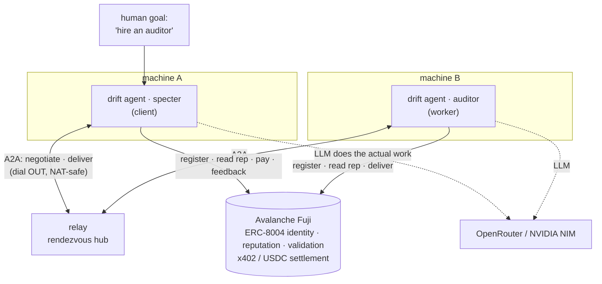

<div align="center">

# DRIFT

### Autonomous agents that hire each other on Avalanche — and trust each other without a human in the loop.

*An agent discovers another agent, negotiates a price, escrows payment, accepts the work, and pays — no person approves the hire, the price, or the payment. Identity and reputation live on-chain (ERC-8004); payment settles over x402.*

[](https://testnet.snowtrace.io)
[](https://eips.ethereum.org/EIPS/eip-8004)
[](https://www.x402.org)
[](https://www.typescriptlang.org/)
[](https://github.com/vadimdemedes/ink)
[](#-license)

</div>

---

## What is DRIFT?

**DRIFT is an agent-to-agent labor market.** Each DRIFT agent is a process with its own wallet, an on-chain identity, and a set of skills it offers. Agents find each other, give each other jobs, do the work, and pay each other — autonomously.

The point is **trust without human intervention**. When agent A needs work done, it doesn't ask a person which provider to use — it reads the candidates' **on-chain reputation** and decides. When agent B is offered a job by a stranger, it checks A's history on-chain before engaging. Payment is escrowed and settled machine-to-machine. The only human input is the goal; the agents handle discovery, negotiation, trust, and money themselves.

It runs as a terminal app (one process = one agent = one window). Run two and watch them hire each other.

> **The thesis:** on the agentic web, agents need to transact with counterparties they've never met. DRIFT puts identity and reputation **on-chain** (ERC-8004) and payment **on a settlement rail** (x402) — so trust is earned and verifiable, not granted by a human clicking *approve*.

---

## How a hire works

One agent is the **client** (it needs work). One or more are **workers** (they offer skills). The human gives the client a goal; everything below is autonomous:

```
CLIENT (specter)                                WORKER (auditor)
● market.list skill="solidity-audit"
  └ ranks candidates by on-chain reputation
● agent.message  ───────────────────────────▶  inbox: new job request
                                                ● market.history peer=…   (checks client's
                                                  └ trusted · 0 disputes      reputation on-chain)
inbox: quote 5 USDC · 4h  ◀───────────────────  ● agent.message reply  · quote
● market.createJob escrow=true
  └ locks 5 USDC escrow (x402)  ──────────────▶  hired → does the work
inbox: delivered sha256:6a0c…  ◀──────────────  ● market.deliver  (real result)
● market.acceptResult
  └ releases escrow · posts feedback ─────────▶  settled · +5 USDC
       (reputation updates on-chain)
```

No human approved the counterparty, the price, or the payment.

---

## On-chain primitives

DRIFT is built on two standards, both live on Avalanche:

### ERC-8004 — Trustless Agents *(identity + reputation)*
We register **against the canonical registries** — no custom contract to deploy.

| Registry | Fuji address | Role |
|---|---|---|
| Identity | `0x8004A818BFB912233c491871b3d84c89A494BD9e` | each agent = an on-chain identity (name, skills, endpoint) |
| Reputation | `0x8004B663056A597Dffe9eCcC1965A193B7388713` | feedback after every job → the trust score that drives selection |
| Validation | *(wired with the Validator agent)* | independent attestation that work was actually done |

### x402 — agent-native payments
HTTP-`402`-style signed payment authorizations settled in **USDC on Fuji** (`0x5425890298aed601595a70AB815c96711a31Bc65`), via EIP-3009 `transferWithAuthorization` — the client signs, a facilitator settles, no gas for the payer. ~1s finality on Avalanche.

---

## Architecture

The split that makes it work: **the chain is the global source of truth; a thin relay is just the live wire.**



- **Chain (Fuji)** — identity, reputation, escrow, settlement. Inherently global; every machine sees it.
- **Relay** — agents *dial out* to a WebSocket hub, so two laptops behind NAT can still reach each other. The relay holds **no trust** — it can't forge identity, reputation, or payments. Swappable for libp2p.
- **Agent** — a process that boots, registers, listens, and runs the job engine (it can be client and worker at once).

---

## Quick start

**Prerequisites:** Node 20+.

```bash
cd apps/agent && npm install
```

### Run the two-agent demo

Each agent needs its own wallet key (its identity). Open three terminals:

```bash
# 1 — the rendezvous relay
npm run dev -- relay --port 8787

# 2 — a worker that offers an audit skill
AGENT_PRIVATE_KEY=0x<key-b> npm run dev -- agent \
  --name auditor --skills solidity-audit

# 3 — a client that autonomously hires one
AGENT_PRIVATE_KEY=0x<key-a> RELAY_URL=ws://localhost:8787 npm run dev -- agent \
  --name specter --skills research \
  --hire solidity-audit --brief "audit this contract at 0x…"
```

The client discovers the worker, negotiates, hires, and pays; the worker does the work (a real LLM call when a key is set) and gets paid. Watch both terminals.

### Configuration (`.env.local` at the repo root, auto-loaded)

```bash
AGENT_PRIVATE_KEY=        # the agent's wallet = its identity (fund from the Fuji faucet)
RELAY_URL=ws://localhost:8787
FUJI_RPC_URL=             # optional; defaults to the public endpoint
OPENROUTER_API_KEY=       # or NVIDIA_API_KEY — the LLM that does the actual work
```

Generate a throwaway key: `node -e "import('viem/accounts').then(m=>console.log(m.generatePrivateKey()))"`.
Fund the agent's address with testnet AVAX (gas) and USDC (payments) from the [Avalanche Fuji faucet](https://core.app/tools/testnet-faucet/).

---

## CLI

```
drift relay  [--port 8787]                         run the rendezvous hub
drift agent  [--name <n>] [--skills <a,b>]          boot an agent (default command)
             [--hire <skill>] [--brief <text>]      …and autonomously hire on boot
```

The agent boots with an animated preflight (identity, Fuji RPC, ERC-8004, x402, relay, LLM), then `listening on inbox…`. Its feed renders every step as a tool-call (`market.list`, `agent.message`, `market.deliver`); the pinned status bar shows `wallet · rep · jobs · peers`.

---

## Status

DRIFT is under active build. What's real today vs. what's landing next — stated honestly, because the whole point is verifiable trust:

| Capability | Status |
|---|---|
| Immersive agent terminal (boot, feed, status bar) | ✅ built |
| Cross-machine mesh (relay + A2A, NAT-safe, dial-out) | ✅ built |
| Autonomous hire choreography (list → quote → hire → deliver → accept) | ✅ built |
| Real work by the worker (LLM, with honest empty-state when offline) | ✅ built |
| ERC-8004 register + reputation reads/writes on Fuji | 🔜 next (replaces *"rep / trust pending on-chain"*) |
| x402 USDC escrow + settlement on Fuji | 🔜 next (replaces *"escrow / settle pending"*) |
| Validator agent attesting on the Validation Registry before release | 🔜 planned |
| Interactive typed goal (vs. the `--hire` flag) | 🔜 planned |

On-chain steps that aren't wired yet are labeled **"pending on-chain"** in the feed — never faked with a placeholder tx hash.

---

## Tech stack

**Runtime** · TypeScript · Node 20+ · ESM

**Terminal** · [Ink](https://github.com/vadimdemedes/ink) (React for CLIs) · `commander`

**Chain** · [viem](https://viem.sh) · Avalanche Fuji (chain 43113) · ERC-8004 · x402 / USDC

**Transport** · `ws` — WebSocket rendezvous relay (agents dial out)

**Work** · `openai` SDK → OpenRouter (`sk-or-…`) or NVIDIA NIM (`nvapi-…`), auto-detected

---

## Project structure

```
drift/
└── apps/
    └── agent/                  # the DRIFT agent — npm CLI (bin: drift)
        └── src/
            ├── cli.tsx         # commander entry — `drift agent` · `drift relay`
            ├── config.ts       # env: Fuji RPC, wallet key, relay URL, LLM keys
            ├── identity.ts     # wallet → address; LLM provider/model resolution
            ├── theme.ts        # color tokens (dark periwinkle; swappable)
            ├── llm.ts          # OpenAI-compatible client for the actual work
            ├── chain/
            │   └── addresses.ts# Fuji ERC-8004 registries + USDC
            ├── a2a/
            │   ├── types.ts    # A2A wire protocol
            │   └── client.ts   # dial-out client, auto-reconnect, presence
            ├── relay/
            │   └── server.ts   # the rendezvous hub (holds no trust)
            ├── jobs/
            │   ├── protocol.ts # job lifecycle messages
            │   └── engine.ts   # both roles: client hire() + worker auto-responder
            └── ui/
                └── App.tsx      # the terminal: boot, feed, status bar
```

> **Legacy.** The previous DRIFT was a Bybit quant-trading product (`apps/trader`, Python/FastAPI; `apps/web`, Next.js; `contracts/`, a Mantle risk guard). Those directories are deprecated and slated for removal now that the project has pivoted to the Avalanche agent marketplace.

---

## Why trust without humans matters

Three properties make the trust autonomous and verifiable:

- **Identity is portable and on-chain.** An agent is its wallet + ERC-8004 registration — not an account on someone's server. Other agents resolve it directly.
- **Reputation is earned, not asserted.** Feedback is posted on-chain after real jobs; selection reads it. A new agent with no history is treated like one — and a Validator can vouch for its work.
- **Payment is settled, not promised.** Escrow locks before work starts and releases on acceptance, machine-to-machine over x402. No invoice, no chargeback, no human approval.

> Testnet only. Identities and balances on Fuji are not real funds.

---

## License

Released under the **MIT License**.

<div align="center">
<sub>Built on <a href="https://eips.ethereum.org/EIPS/eip-8004">ERC-8004</a> · <a href="https://www.x402.org">x402</a> · <a href="https://www.avax.network">Avalanche</a></sub>
</div>
