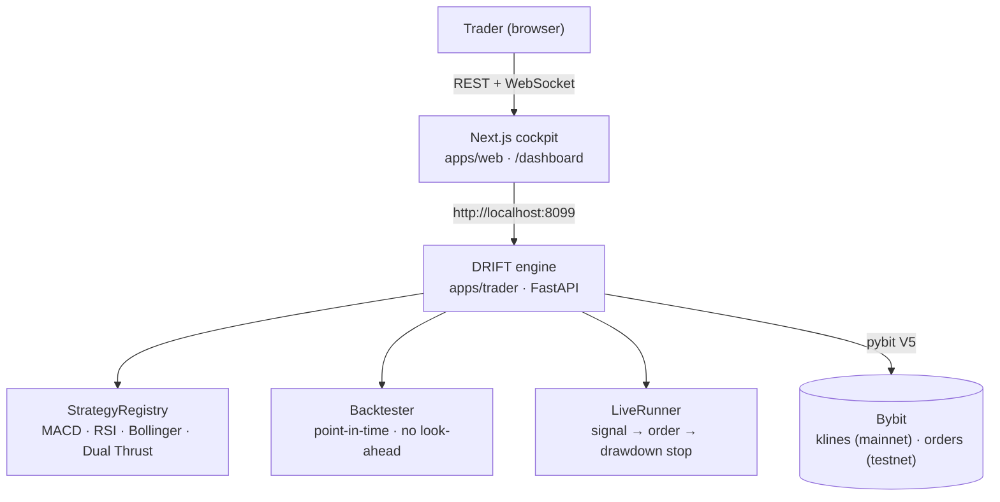

<div align="center">

# DRIFT

### Transparent quant strategies on Bybit — with backtests that don't lie.

*Deterministic, risk-bounded trading. Strictly point-in-time backtests, a drawdown stop that lives in code, and every parameter on a slider — no black box.*

[](https://bybit-exchange.github.io/docs/v5/intro)
[](https://www.python.org/)
[](https://fastapi.tiangolo.com/)
[](https://nextjs.org)
[](https://www.typescriptlang.org/)
[](#-license)

</div>

---

## What is DRIFT?

Most trading bots sell a backtest you can't trust — fit in hindsight, leaking
future information, and wrapping discretionary risk in a promise. **DRIFT is a
trading cockpit built to be checked.** Browse classic strategies, backtest them
against real Bybit market history under strict point-in-time rules, and deploy a
bot to Bybit testnet where a per-bot drawdown stop is enforced in code — not left
to discipline.

It ships as two things on one engine:

- **A backtest cockpit** — pick a strategy, tune every parameter on a slider, and
  run it against live Bybit klines. Read an honest equity curve, drawdown, Sharpe,
  win rate, and trade markers.
- **A live runner** — connect Bybit testnet keys and deploy a bot that places real
  market orders, streams fills and equity over WebSockets, and flattens + halts
  itself on a drawdown breach.

> **The thesis:** an edge is only an edge if it survives an honest test. DRIFT
> refuses look-ahead, makes risk a hard constraint the runner enforces, and keeps
> every signal readable — so what you backtest is what you'd actually have traded.

---

## Features

### The backtest cockpit
- **Strategy library** — MACD, RSI, Bollinger, and Dual Thrust, ported from open research.
- **Configure everything** — symbol, timeframe, and each strategy parameter on a live slider.
- **Honest metrics** — total return, Sharpe, win rate, max drawdown, and trade count.
- **Point-in-time** — a signal on bar *t* only trades on bar *t+1*; no look-ahead, no mirage.
- **Real data** — backtests run on live Bybit mainnet klines, never synthetic series.

### The live runner
- **Bybit testnet execution** — real market orders via the V5 API; nothing simulated.
- **Risk in code** — per-bot position size and a max-drawdown stop that flattens and halts on breach.
- **Live stream** — equity, position, signal state, and fills pushed over a WebSocket.
- **Keys stay yours** — API keys are held in memory for the session only, never written to disk.

---

## 🏛️ Architecture

A Python engine does the work; a Next.js cockpit drives it over local REST + WebSocket.



**Why two pieces:** the engine holds live market state, runs the vectorised
backtester, and drives long-running bot loops — so it's a real Python service, not
a serverless function. The cockpit is a static/serverless Next.js app that only
talks to the engine.

---

## How a backtest works

```
klines ─▶ strategy.positions() ─▶ shift +1 bar ─▶ equity curve + metrics
  │              (target -1/0/1)     (no look-ahead)        │
real Bybit history                                    Sharpe · maxDD · win rate · trades
```

1. **Fetch** the most recent candles for a symbol/timeframe from Bybit.
2. **Signal** — the strategy turns OHLCV into a target position series in `{-1, 0, 1}`.
3. **Earn it next bar** — positions are shifted forward one bar, so no signal trades
   on information from its own candle.
4. **Score** — equity curve, drawdown, Sharpe, win rate, and round-trip trade markers.

> Honesty rule, baked in: a signal decided on bar *t* is only earned over bar *t+1*
> (cf. *Profit Mirage*, [arXiv:2510.07920](https://arxiv.org/abs/2510.07920)).

---

## The cockpit

| Route | What it does |
|-------|--------------|
| `/` | Landing — what DRIFT is and why honest backtests matter |
| `/dashboard` | **Backtest** — strategy library, parameter sliders, equity/drawdown/price charts, metrics |
| `/dashboard/live` | **Live bots** — deploy to testnet, watch fills + equity stream, kill switch |
| `/dashboard/connection` | **Connection** — set Bybit testnet keys (held in memory only) |

---

## Strategies

| Strategy | Type | Signal |
|----------|------|--------|
| **MACD Oscillator** | Momentum | Fast/slow moving-average crossover; long while momentum is positive |
| **RSI Reversion** | Mean reversion | Long when oversold, exit when overbought (Wilder's smoothing) |
| **Bollinger Reversion** | Mean reversion | Buy a close below the lower band; exit back at the middle band |
| **Dual Thrust** | Breakout | Long/short the prior close ± k·range over a rolling window |

All four are ported from
[je-suis-tm/quant-trading](https://github.com/je-suis-tm/quant-trading).

---

## Quick start

**Prerequisites:** Python 3.9+ and Node 20+.

### 1. Engine (`apps/trader`)

```bash
cd apps/trader
python3 -m venv .venv
.venv/bin/pip install -r requirements.txt
.venv/bin/uvicorn app.main:app --reload --port 8099
```

Sanity check — a real backtest from live Bybit data:

```bash
curl "http://localhost:8099/backtest?strategy=macd&symbol=BTCUSDT&timeframe=1h"
```

### 2. Cockpit (`apps/web`)

```bash
npm install
npm run dev          # http://localhost:3000
```

The cockpit reads the engine at `http://localhost:8099` by default; override with
`NEXT_PUBLIC_TRADER_URL`.

### 3. Go live (optional)

Create **testnet** API keys at [testnet.bybit.com](https://testnet.bybit.com)
(read + trade scope), add them on the **Connection** tab, then deploy a bot from
**Live bots**. Backtesting needs no keys; live trading does.

---

## Tech stack

**Engine** · Python 3.9 · FastAPI · Uvicorn · [`pybit`](https://github.com/bybit-exchange/pybit) (Bybit V5) · pandas · NumPy

**Web** · Next.js 16 (App Router) · React 19 · TypeScript · Tailwind v4 · Framer Motion · GSAP

**Data** · Bybit V5 — mainnet klines for backtests, testnet for live orders

---

## Project structure

```
drift/
├── apps/
│   ├── trader/                 # Python engine → FastAPI on :8099
│   │   ├── app/
│   │   │   ├── main.py         # REST + WebSocket routes
│   │   │   ├── config.py       # timeframe ↔ Bybit interval map, annualisation
│   │   │   ├── models.py       # pydantic request/response schemas
│   │   │   ├── bybit_client.py # pybit V5 wrapper (klines, orders, wallet)
│   │   │   ├── backtester.py   # point-in-time backtest → equity + metrics
│   │   │   ├── live.py         # connection + bot manager + runner loop
│   │   │   └── strategies/     # base · macd · rsi · bollinger · dual_thrust · registry
│   │   └── requirements.txt
│   │
│   └── web/                    # Next.js cockpit → :3000
│       └── src/
│           ├── app/            # / (landing) · /dashboard{,/live,/connection}
│           └── features/
│               ├── landing/    # dark marketing site
│               ├── dashboard/  # sidebar/topbar shell + primitives
│               └── trade/      # cockpit: backtest, live bots, connection, charts
└── README.md
```

---

## API reference

Served by the engine (`apps/trader`), consumed by the cockpit.

| Group | Endpoints |
|-------|-----------|
| **Health** | `GET /health` |
| **Strategies** | `GET /strategies` |
| **Backtest** | `POST /backtest` · `GET /backtest?strategy=…&symbol=…` |
| **Connection** | `GET /connection` · `POST /connection` |
| **Bots** | `GET /bots` · `POST /bots` · `GET /bots/{id}` · `DELETE /bots/{id}` |
| **Stream** | `WS /bots/{id}/stream` |

---

## 🔒 Safety & honesty

- **Testnet-first.** Live trading is explicit opt-in and runs on Bybit testnet by default.
- **Risk is enforced, not promised.** Position size and the max-drawdown stop live in
  the `LiveRunner` — on breach it flattens the position and stops the bot.
- **No look-ahead, no fabricated fills.** Backtests are strictly point-in-time; live
  equity is read from the real account. Nothing is simulated.
- **Keys never touch disk.** Bybit credentials are held in memory for the session only.

> Trading involves risk. Backtested performance is not indicative of future results.

---

## 📄 License

Released under the **MIT License**.

<div align="center">
<sub>Strategies ported from <a href="https://github.com/je-suis-tm/quant-trading">je-suis-tm/quant-trading</a> · Built on <a href="https://bybit-exchange.github.io/docs/v5/intro">Bybit V5</a></sub>
</div>
