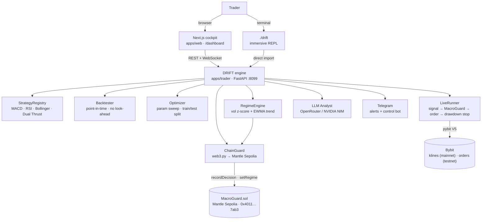

<div align="center">

# DRIFT

### AI quant bots + macro-driven smart contracts on Bybit — with backtests that don't lie.

*Four classical strategies. An optimizer that finds what survives. An on-chain risk guard on Mantle that can't be overridden. An LLM analyst that explains, never executes.*

[](https://bybit-exchange.github.io/docs/v5/intro)
[](https://sepolia.mantlescan.xyz)
[](https://www.python.org/)
[](https://fastapi.tiangolo.com/)
[](https://nextjs.org)
[](https://www.typescriptlang.org/)
[](#-license)

</div>

---

## What is DRIFT?

Most trading bots sell a backtest you can't trust — fit in hindsight, leaking future information, and wrapping discretionary risk in a promise. **DRIFT is a quant-trading cockpit built to be checked.**

Browse four classical strategies, backtest them on real Bybit market history under strict point-in-time rules, let the optimizer find what actually survives out-of-sample, and deploy a bot where a per-bot drawdown stop is enforced in code and every trade decision is recorded on-chain by a Solidity risk guard on Mantle — a benchmark trail that can't be edited.

It ships as three things on one engine:

- **A terminal agent** (`./drift`) — an immersive full-screen REPL with live markets, backtests, an AI analyst, and live bots. Just talk to it.
- **A web cockpit** (`apps/web`) — a consumer dashboard with candlestick charts, per-bot equity streams, and an auto-research optimizer.
- **A Python FastAPI engine** (`apps/trader`) — the shared brain: strategy library, backtester, live bot runner, MacroGuard wiring, LLM analyst, and Telegram control bot.

> **The thesis:** an edge is only an edge if it survives an honest test. DRIFT refuses look-ahead, makes risk a hard constraint the runner enforces, and logs every decision to an immutable on-chain trail — so what you backtest is what you'd actually have traded, and the guard can't be overridden when things go wrong.

---

## Features

### Strategy library + honest backtester
- **4 strategies** — MACD, RSI, Bollinger, Dual Thrust, ported from open research.
- **Point-in-time** — signal on bar *t* only trades on bar *t+1*; no look-ahead, no *Profit Mirage* ([arXiv:2510.07920](https://arxiv.org/abs/2510.07920)).
- **Real data** — backtests run on live Bybit mainnet klines, never synthetic series.
- **Honest metrics** — total return, Sharpe, win rate, max drawdown, round-trip trade count.

### Auto-Research optimizer
- Sweeps the parameter space for every strategy with a configurable grid.
- Splits data 70% train / 30% test: picks the best config by **in-sample Sharpe** (among configs with ≥2 trades), then reports **out-of-sample** metrics.
- Verdicts: **robust** (IS ≥ 0.5 & OOS ≥ 0.5), **overfit** (IS strong, OOS collapses), **weak**.
- The winner becomes a one-click deploy.

### MacroGuard — on-chain risk enforcer (Mantle Sepolia)
- `MacroGuard.sol` deployed at `0x4011cbAc551541ae6116db3a0a4f543F89fE7ab3` on Mantle Sepolia (chain 5003).
- Every bot tick calls `recordDecision(symbol, signal, price, drawdown)` — a permanent, tamper-proof benchmark trail of every trade the AI made.
- `allowed(signal)` is the veto gate: halted flag trips irreversibly when drawdown breaches the limit; risk-off regime blocks new longs.
- A **regime engine** (`regime.py`) classifies BTC 1h candles into risk-on / neutral / risk-off using realised-vol z-score + EWMA trend, and autonomously pushes `setRegime` on-chain when the label changes — so the veto is driven by real market conditions, not manual config.

### LLM analyst — explains, never executes
- On-demand analysis over the live computed regime and market snapshot.
- **Two providers supported:** OpenRouter (`sk-or-…`, default model `anthropic/claude-3.5-sonnet`) or NVIDIA NIM (`nvapi-…`, default `nvidia/nemotron-3-super-120b-a12b`). Detected automatically from the key prefix.
- The LLM **never touches the trade loop** — strategies, the optimizer, and the regime engine are fully deterministic. The analyst explains what the system sees.
- `analyze btc` in the terminal streams reasoning + answer live.

### Conversational agent
- Type anything at the `>` prompt — unknown input routes to the LLM agent, not an error.
- Backed by an OpenAI tool-call loop over read/compute tools: `get_markets`, `get_market`, `get_regime`, `run_backtest`, `get_chain`.
- Deploy is deliberately **not a tool** — the agent hands you the exact `bot …` command instead of placing orders autonomously (human in the loop).

### Live bot runner (Bybit testnet)
- Real market orders via Bybit V5 API; nothing simulated.
- Per-bot drawdown stop flattens the position and halts on breach.
- Every tick: signal → MacroGuard veto check → order (if not vetoed) → `recordDecision` on-chain.
- Fills, equity, and chain tx streamed live over WebSocket.

### Telegram alerts + two-way control
- Alerts on regime flips, fills, and drawdown stops.
- Two-way control bot: `/status` `/regime` `/markets` `/chain` `/bots` `/analyze sym` `/deploy strat sym` `/kill id|all`.
- Connect from CLI (`telegram connect <token>`) or the web Connection panel.

---

## Architecture



---

## How a backtest works

```
klines ─▶ strategy.positions() ─▶ shift +1 bar ─▶ equity curve + metrics
  │              (target -1/0/1)     (no look-ahead)        │
real Bybit mainnet history                         Sharpe · maxDD · win rate · trades
```

1. **Fetch** the most recent candles from Bybit mainnet.
2. **Signal** — the strategy maps OHLCV → target position series in `{-1, 0, 1}`.
3. **Earn it next bar** — positions shift forward one bar; no signal trades on its own candle.
4. **Score** — equity curve, drawdown, Sharpe, win rate, round-trip trade count.

---

## Strategies

| Strategy | Type | Signal | Defaults |
|----------|------|--------|----------|
| **MACD Oscillator** | Momentum | Long while fast MA > slow MA | fast=10, slow=21 |
| **RSI Reversion** | Mean reversion | Long when RSI < 30, exit > 70 (Wilder's) | period=14 |
| **Bollinger Reversion** | Mean reversion | Buy below lower band, exit at midline | window=20, k=2 |
| **Dual Thrust** | Breakout | Long/short breakout of prior close ± k·range | window=5, k=0.5 |

All four are ported from [je-suis-tm/quant-trading](https://github.com/je-suis-tm/quant-trading).

---

## Quick start

**Prerequisites:** Python 3.9+, Node 20+.

### Terminal only (fastest)

```bash
./drift          # sets up .venv + installs deps on first run, then launches
```

On first launch it prompts for an LLM API key (OpenRouter or NVIDIA NIM). Bybit read keys auto-connect from `.env.local` if present.

### Engine only (`apps/trader`)

```bash
cd apps/trader
python3 -m venv .venv && .venv/bin/pip install -r requirements.txt
.venv/bin/uvicorn app.main:app --reload --port 8099
```

Sanity check — a real backtest on live Bybit data:

```bash
curl "http://localhost:8099/backtest?strategy=macd&symbol=BTCUSDT&timeframe=1h"
```

### Web cockpit (`apps/web`)

```bash
cd apps/web && npm install && npm run dev   # http://localhost:3000
```

The cockpit reads the engine at `http://localhost:8099` by default; override with `NEXT_PUBLIC_TRADER_URL`.

### Live bots (Bybit testnet)

Create testnet API keys at [testnet.bybit.com](https://testnet.bybit.com) with **Orders + Positions** scope, add them on the **Connection** tab or via `connect` in the terminal, then deploy a bot. Get testnet funds from the Bybit testnet faucet (API Management → "Get testnet coins").

### MacroGuard (on-chain, optional)

```bash
# in apps/trader/.env.local (or root .env.local)
MACROGUARD_ADDRESS=0x4011cbAc551541ae6116db3a0a4f543F89fE7ab3
ETH_PRIVATE_KEY=<your deployer key>
MANTLE_RPC_URL=https://rpc.sepolia.mantle.xyz   # default
```

When set, every bot tick calls `recordDecision` on Mantle Sepolia and the regime engine autonomously pushes `setRegime` every 15 minutes.

---

## The terminal

```bash
./drift
```

Full-screen alternate-screen REPL — pinned `sys` header + status bar (BTC/ETH/SOL live prices), scroll region in between. `readline` editing and history at `>`.

```
sys    connected to bybit · testnet · 0.00 USDT
────────────────────────────────────────────────
> research btc 1h
  agent drift · testnet · BTC ▲97,421 · ETH ▲3,218 · SOL ▲152 · bots 0
```

| Command | What it does |
|---------|--------------|
| `markets` | Live prices across tracked symbols |
| `chart <sym> [tf]` | ASCII price chart |
| `strategies` | Explain all strategies with params |
| `backtest <strat> <sym> [tf]` | Point-in-time backtest + equity chart |
| `research <sym> [tf]` | Auto-Research optimizer (train/test leaderboard) |
| `analyze <sym>` | LLM analyst over the live regime |
| `bot <strat> <sym> [tf] [qty] [dd]` | Live testnet bot (Ctrl-C to flatten) |
| `connect` / `status` | Set or show Bybit connection |
| `chain` | MacroGuard contract + live regime |
| `telegram [connect\|test]` | Connect Telegram alerts + control bot |
| `clear` / `quit` | Clear screen · exit |
| *anything else* | Conversational agent (e.g. "how's btc?") |

---

## The web cockpit

| Route | What it does |
|-------|--------------|
| `/` | Landing — what DRIFT is and why honest backtests matter |
| `/login` | Google sign-in (gates the cockpit when `AUTH_ENABLED`) |
| `/dashboard` | **Markets** — live prices, candlestick, deploy a bot inline |
| `/dashboard/bots` | **Bots** — per-bot candlestick with fill markers, equity, P&L, MacroGuard badge |
| `/dashboard/portfolio` | **Portfolio** — account equity, running bots, positions, live P&L |
| `/dashboard/backtest` | **Research** — Auto-Research optimizer + manual backtest cockpit |
| `/dashboard/connection` | **Connection** — Bybit keys, MacroGuard status, Telegram |

---

## Tech stack

**Engine** · Python 3.9 · FastAPI · Uvicorn · [`pybit`](https://github.com/bybit-exchange/pybit) (Bybit V5) · pandas · NumPy · web3.py (Mantle) · openai SDK (LLM) · requests (Telegram)

**Terminal** · Rich · raw ANSI (alternate screen + DECSTBM scroll region)

**Web** · Next.js 16 (App Router) · React 19 · TypeScript · Tailwind v4 · Framer Motion · GSAP

**Chain** · Solidity 0.8.24 · Foundry · Mantle Sepolia (chain 5003)

**Data** · Bybit V5 — mainnet klines for backtests, testnet for live orders

---

## Project structure

```
drift/
├── drift                       # one-command launcher for the terminal
├── contracts/                  # Foundry project
│   └── src/MacroGuard.sol      # on-chain risk guard (Mantle Sepolia)
├── apps/
│   ├── trader/                 # Python engine → FastAPI :8099
│   │   ├── app/
│   │   │   ├── main.py         # REST + WebSocket routes + startup tasks
│   │   │   ├── cli.py          # interactive terminal REPL (Rich + ANSI)
│   │   │   ├── config.py       # env vars, intervals, annualisation
│   │   │   ├── models.py       # pydantic schemas
│   │   │   ├── bybit_client.py # pybit V5 wrapper (klines, orders, wallet)
│   │   │   ├── backtester.py   # point-in-time backtest → equity + metrics
│   │   │   ├── optimize.py     # Auto-Research param sweep + train/test split
│   │   │   ├── live.py         # connection + bot manager + runner loop
│   │   │   ├── regime.py       # HMM-free vol/trend regime classifier
│   │   │   ├── chain.py        # web3.py MacroGuard client (fails open)
│   │   │   ├── llm.py          # LLM analyst (OpenRouter / NVIDIA NIM)
│   │   │   ├── agent.py        # tool-calling conversational agent
│   │   │   ├── telegram.py     # alerts + two-way control bot
│   │   │   └── strategies/     # base · macd · rsi · bollinger · dual_thrust · registry
│   │   └── requirements.txt
│   │
│   └── web/                    # Next.js cockpit → :3000
│       └── src/
│           ├── app/            # / (landing) · /dashboard (markets/bots/portfolio/backtest/connection)
│           └── features/
│               ├── landing/    # dark marketing site
│               ├── dashboard/  # sidebar/topbar shell + primitives
│               └── trade/      # cockpit: backtest, research, live bots, connection, charts
└── README.md
```

---

## API reference

Served by the engine at `:8099`.

| Group | Endpoints |
|-------|-----------|
| **Health** | `GET /health` |
| **Strategies** | `GET /strategies` |
| **Markets** | `GET /markets` · `GET /klines?symbol=…&interval=…&limit=…` |
| **Backtest** | `POST /backtest` · `GET /backtest?strategy=…&symbol=…&timeframe=…` |
| **Optimize** | `POST /optimize` |
| **Regime** | `GET /regime` |
| **Chain** | `GET /chain` |
| **Analyze** | `POST /analyze?symbol=…` |
| **Connection** | `GET /connection` · `POST /connection` |
| **Bots** | `GET /bots` · `POST /bots` · `GET /bots/{id}` · `DELETE /bots/{id}` |
| **Stream** | `WS /bots/{id}/stream` |
| **Telegram** | `GET /telegram` · `POST /telegram` · `POST /telegram/test` |

---

## Deploy (Railway, no Docker)

Railway auto-builds with Nixpacks. The repo ships a `railway.json` in each app.

**Two services from this one repo:**

| Service | Root directory | Start |
|---|---|---|
| `drift-engine` | `apps/trader` | `uvicorn app.main:app --host 0.0.0.0 --port $PORT` |
| `drift-web` | `apps/web` | `npm run start` |

**Engine env:**

```
BYBIT_API_KEY=…
BYBIT_API_SECRET=…
BYBIT_TESTNET=true
ALLOWED_ORIGINS=https://<your-web-domain>
MACROGUARD_ADDRESS=0x4011cbAc551541ae6116db3a0a4f543F89fE7ab3
ETH_PRIVATE_KEY=<deployer key with MNT for gas>
NVIDIA_API_KEY=…          # or OPENROUTER_API_KEY
TELEGRAM_BOT_TOKEN=…
TELEGRAM_CHAT_ID=…
```

**Web env:**

```
NEXT_PUBLIC_TRADER_URL=https://<your-engine-domain>
AUTH_GOOGLE_ID=…          # optional — enables Google login
AUTH_GOOGLE_SECRET=…
AUTH_SECRET=…
```

> **No persistence yet.** Bots, fills, and equity are in-memory — a restart clears them (orders already placed still live at Bybit). Add a DB before relying on this for anything durable.

---

## Safety & honesty

- **Testnet-first.** Live trading is explicit opt-in; all orders go to Bybit testnet by default.
- **Risk is enforced, not promised.** The drawdown stop lives in `LiveRunner`; the on-chain veto lives in `MacroGuard.sol` — both enforce independently, so chain trouble never stalls a bot (the guard fails open).
- **No look-ahead, no fabricated fills.** Backtests are strictly point-in-time; live equity is read from the real account; the LLM is forbidden from inventing numbers.
- **Keys never touch disk.** Bybit credentials held in memory only. The LLM key is prompted at terminal start and stored in memory, not written to any file.
- **The LLM never executes.** The analyst explains; the deterministic strategy + on-chain guard decide.

> Trading involves risk. Backtested performance is not indicative of future results.

---

## License

Released under the **MIT License**.

<div align="center">
<sub>Strategies ported from <a href="https://github.com/je-suis-tm/quant-trading">je-suis-tm/quant-trading</a> · Built on <a href="https://bybit-exchange.github.io/docs/v5/intro">Bybit V5</a> · On-chain guard on <a href="https://sepolia.mantlescan.xyz/address/0x4011cbAc551541ae6116db3a0a4f543F89fE7ab3">Mantle Sepolia</a></sub>
</div>
